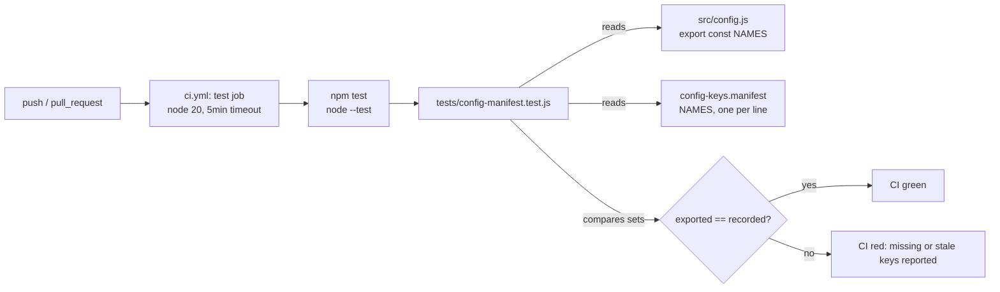

There is no server, database, or runtime beyond the test process — `npm test`
*is* the product. The only data flow that matters is the two-file diff done
by `tests/config-manifest.test.js`: it regex-parses `export const` names out
of `src/config.js` and diffs that set against the non-comment, non-blank
lines of `config-keys.manifest`, failing on either a missing or a stale
entry.
